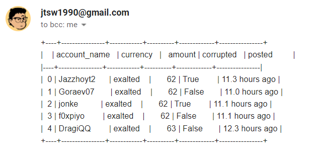
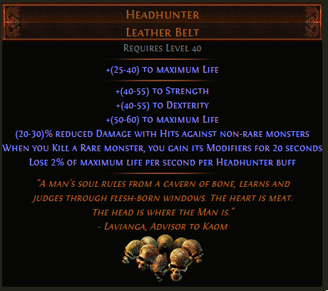

# poe-headhunter-tracker

Simple bot to automatically track and report headhunter prices below a threshold through email.

This bot tracks listings from the [official POE trade website](https://www.pathofexile.com/trade).

# How to use

## Setup

- `git clone` repository or download the latest release

## Config

Adjust the details in `config.json`:
- League
- Currency threshold
- Email address and server
- Item name
- User agent (Cannot access POE trade API without specification)

The bot can technically handle any item query, but is currently built primarily for headhunter price scraping and reporting.

## Running locally

The script can be run both manually and automatically in a secured fashion, without needing the user to expose any passwords or secrets.
Running manually will only call the API and check the listings once.

- run `setup.bat` file, which creates a .env file
- open `.env` with a text editor and enter email secret in the following format:
    `EMAIL_PASSWORD=REPLACE_WITH_YOUR_PASSWORD`
- run `python main.py` to start the script

## Automation

The setup I use automates this script using GitHub actions and my personal Gmail account for reporting.
With gmail, there are a few steps required in the set up of a google account to allow secure logins from GitHub runners.
More details can be found [here]()

- Log into your [google account](https://myaccount.google.com/?utm_source=sign_in_no_continue)
- Nagivate to the security page [here](https://myaccount.google.com/security)
- Ensure that access to less secure apps is turned on. You might want to create another account for this purpose if you want to keep different levels of security for your personal account.
- Ensure that 2-step verification is turned on
- Generate a new app password here [here](https://myaccount.google.com/apppasswords?rapt=AEjHL4PXuRfcGM272Fn2O5BulRNILUfhqfKVHNuKKEi6gO-17YkzFcyGSq2SLX2NmyjNdZr3zwD_4TmRFQmKx6KUYDjK1H9wrQ)
- Copy and paste app password into a newly generated [repository secret](https://github.com/jtsw1990/poe-headhunter/settings/secrets/actions), with the key as `EMAIL_PASSWORD`
- Ensure that the `cron_schedule` is as per requirements in `workflow.yml`. It is defaulted to a 30-minute cadence
- `commit` and `push` local script back into your own repository to kick off the schedule

# Dependencies

| Name  | Version | Purpose |
| ------------- | ------------- | ----------- |
| requests  | 2.26.0 | Library for RESTFUL calls to POE Trade's API |
| pytz  | 2021.3 | Timezone converter for elapsed time formatting |
| tabulate | 0.8.9 | String formatting for neater email reporting |
| numpy | TBC | General data wrangling |
| pandas | TBC | General data wrangling |
| python-dotenv | 0.19.2 | For secure local secrets management |